# Impromptu Premier League Auction System UI/UX Specification

## Introduction
This document defines the user experience goals, information architecture, user flows, and visual design specifications for the Impromptu Premier League Auction System's user interface. It serves as the foundation for visual design and frontend development, ensuring a cohesive, professional, and user-centered experience across all three distinct user roles.

### Overall UX Goals & Principles

#### Target User Personas
- **The Auctioneer (Power User):** Requires high-density information and absolute control. Needs to monitor incoming bids and manage the timer simultaneously without high cognitive load.
- **The Captain (Action-Oriented):** Under time pressure. Needs a mobile-first UI with large, error-proof touch targets and instant status feedback.
- **The Viewer (Passive Audience):** Watching from a distance (projector/TV). Needs large, high-contrast typography and dramatic visual cues to follow the action.

#### Usability Goals
- **Error Prevention (Captains):** Impossible to accidentally bid twice in a row; clear visual distinction between "Proposed" and "Winning" states.
- **Efficiency of Use (Auctioneer):** 1-click bid acceptance. Keyboard shortcuts (optional but recommended) for Hammer and Next Player.
- **Clarity of State (Viewers):** Audience must know exactly who is winning, for how much, and how much time is left within a 1-second glance.

#### Design Principles
1. **Clarity over cleverness** - Prioritize clear communication of numbers and names over aesthetic innovation.
2. **High Contrast & Hierarchy** - Critical data (Current Bid, Timer) must instantly draw the eye.
3. **Immediate feedback** - Every action (proposing a bid, accepting a bid) must have a clear, immediate visual and animated response.
4. **Accessible by default** - Design strictly for WCAG AA compliance, ensuring deep dark themes do not compromise legibility.

---

## Information Architecture (IA)

### Site Map / Screen Inventory

```mermaid
graph TD
    A[App Entry] --> B{Role Selection / Auth}
    B -->|Admin Passcode| C[Auctioneer]
    B -->|Team Passcode| D[Captain]
    B -->|Public| E[Viewer]
    
    C --> C1[Event Setup / Excel Upload]
    C1 --> C2[Auctioneer Live Dashboard]
    
    D --> D1[Captain Live Bidding Screen]
    
    E --> E1[Public Broadcast Display]
```

### 💡 Rationale & Trade-offs
*   **Color Palette:** I moved exactly to the professional slate/charcoal and gold styling you requested. The contrast ensures the text pops beautifully on big screens while keeping a premium, non-gaming feel.
*   **Viewport Lock for Captains:** I added a specific responsive constraint for Captains: *No scrolling allowed*. When people are panic-bidding in a 20-second window, scrolling down to find the button is a terrible UX. The UI will be locked to `100vh`.
*   **Number Tickers:** I specified an animation where the numbers roll up quickly instead of just replacing the text. This tiny micro-interaction creates the "sports broadcast" feel almost single-handedly!